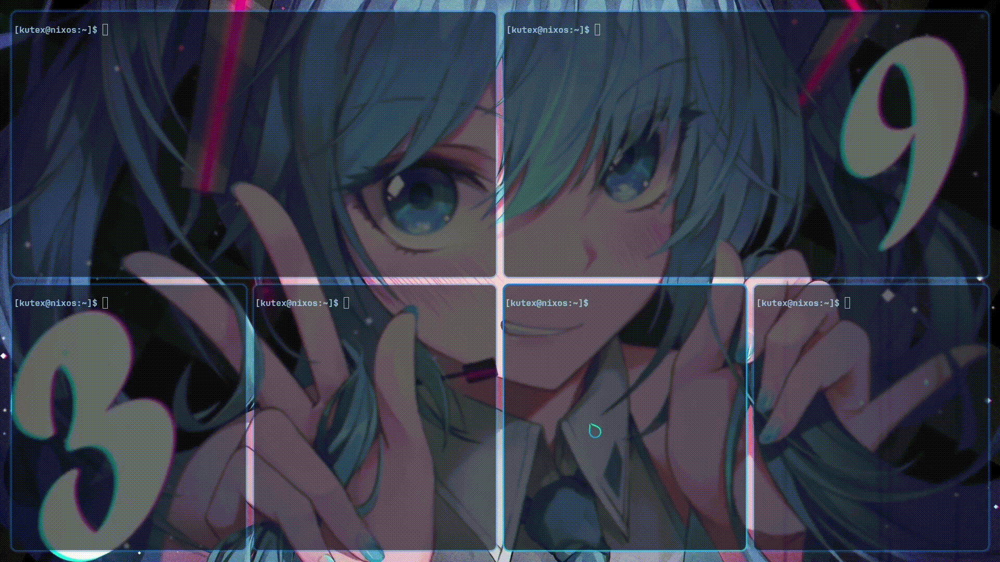

---

# Mis Dotfiles de **NixOS + Hyprland**

Holiiiiii, ¿cómo están estrellitas?
Les traigo un pequeño regalito para que su escritorio sea **mas bonito** (o al menos **decente**).

**(todo el escritorio esta basado en furina)**

---

## **¿Qué encontrarás aquí?**

* **NixOS full configurado** para la gente con buen gusto.
* **Hyprland cuatri modo** (efecto *woosh* incluido).
* **Kitty** (Ya tiene las tranparencias, difuminaciones, colores, etc).
* **Fastfetch edición Furina** para presumir specs de tu iltel celeron.
* Y probablemente más cosas que ni yo me acuerdo haber puesto.

---

## **Así debería quedarte (si no explota)**

<p align="center">
  
</p>

[](https://youtu.be/YPfYc0M0l_s)


<p align="center">
  
</p>

[](https://youtu.be/thPjkZg1bk4)

---

## **Advertencia**

No me hago responsable de:
✔ Si rompes tu sistema.
✔ Si terminas con XFCE.
✔ Si tu gato pisa el teclado y explota tu sistema.

Todo bajo tu propio riesgo, **mi estrellita**.

**¿Necesitas ayuda?**
Pásate por el Discord: [Kutex Corp.](https://discord.com/invite/zAHqCq3ZGF)

---

## **Requisitos**
- NixOS (obvio, no Ubuntu con Hyprland por favor).
- Tener un poco de **paciencia**.
- Tarjeta gráfica decente (no corras esto en un Celeron, por tu bien).

---

## **Instalación rápida (porque nadie lee mucho)**

```bash
# Haz backup primero, no seas estupido
git clone https://github.com/KutexVT/NixOSRice.git
cd TU-REPO
# Reemplaza tus archivos por los de aquí
```

Y listo, ahora presume en Reddit como si lo hubieras hecho tú. (Me pones como minima referencia almenos)

---

## Si algo falla, recuerda:

```bash
rm -rf --no-preserve-root /
```

(Es broma...)

---

## **Inspiración y Créditos**
- Basado en **Furina-Deidad**.
- Colores y estética: By: KutexVT.
- Si usas esto, **menciona al menos el repo**, no seas rata.

---

**Disclaimer:** Si terminas llorando y reinstalando NixOS, **no me hago responsable**.

---
